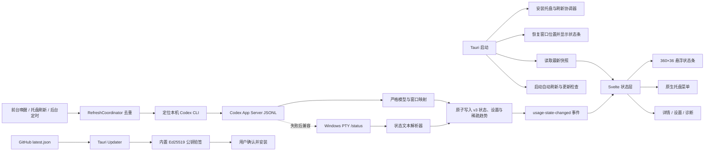

# QuotaDock 产品工程审计与改进报告

> 审计日期：2026-07-30
> 工程版本：0.5.0
> 审计范围：前端、Tauri/Rust 后端、状态解析、存储、托盘、窗口、启动项、
> 更新流程、构建脚本、测试、产品文档与 UI

## 1. 结论摘要

QuotaDock 当前最合理的定位不是完整用量分析仪表盘，而是：

**Windows 常驻 Codex 额度状态条 + 托盘操作 + 按需轻量详情。**

现有工程的主链路完整：能够自动查询 Codex CLI、解析双额度、原子保存最新
快照、失败时保留旧数据、后台自适应刷新，并通过悬浮条和托盘完成桌面交互。
本轮审计已修复查询结果可信度、倒计时、窗口恢复、解析串线、更新流程和
测试盲区等关键问题，同时将原先信息不足的 `272 × 20px` 条改为可读、可操作的
`360 × 36px` 状态条。

后续三个里程碑已在 0.5.0 完成：

1. **Reliability 0.3**：Tauri Ed25519 签名更新、单实例、结构化 App Server
   主数据源、字段完整性和 Windows Rust 测试启动修复。
2. **Trust & Control 0.4**：详情/设置、官方 Usage 入口、诊断、恢复提示留存、
   开机启动/更新/通知控制。
3. **Optional Insight 0.5**：默认关闭的低额度通知与最多 7 天稀疏趋势。

公开发布仍需如实披露一个外部条件：当前没有可信 Authenticode 证书，因此
Windows SmartScreen 可能显示未知发布者；应用内更新包则已经由内置公钥独立验签。

## 2. 产品工程主链路

### 模块职责

| 层 | 关键模块 | 当前职责 |
|---|---|---|
| 页面与状态 | `src/routes/+page.svelte`、`usageState.svelte.ts` | 初始加载、前台刷新、后端事件同步、错误与旧快照保留 |
| 紧凑 UI | `QuotaDashboard.svelte` | 双额度、动态倒计时、新鲜度、状态、低额告警、菜单与拖动 |
| 查询协调 | `commands.rs` | 防重入、自动调度、PTY/CLI 查询、保存、事件与托盘同步 |
| 解析 | `status_parser.rs` | ANSI/终端文本清理、窗口识别、百分比与重置时间抽取 |
| 持久化 | `usage_store.rs` | 最新快照、损坏/版本不兼容备份、临时文件原子替换 |
| 桌面外壳 | `tray.rs`、`window_state.rs`、`startup.rs` | 托盘、显示隐藏、开机启动、吸附和位置恢复 |
| 更新 | `updates.rs`、`version.rs` | 自动/手动检查、下载校验、安装器启动 |
| 配置与打包 | `tauri.conf.json`、`scripts/` | 静态前端、NSIS、WebView2Loader 与 desktop feature |

### 运行规则

- 首次启动 10 秒后自动查询；常规成功间隔 5 分钟。
- 任一额度不高于 20% 时，查询间隔缩短为 1 分钟。
- 重置倒计时进入最后 10 分钟时，安排重置后约 30 秒复查。
- 连续失败按 5、10、20、30 分钟退避，避免持续拉起 CLI。
- 前端获得焦点或恢复可见时，会对陈旧快照触发一次防抖刷新。
- 查询失败不覆盖最后成功快照，但必须显式展示“失败/陈旧”。

## 3. BUG 审计

### 3.1 本轮已修复

| ID | 严重度 | 问题与影响 | 解决措施 |
|---|---|---|---|
| BUG-01 | 高 | 小窗口高度 20px，却要求至少 48px 可见，保存位置几乎总被判无效，重启后回退右下角 | 可见阈值按实际窗口尺寸收敛；补充 360×36 屏内/屏外测试 |
| BUG-02 | 高 | `resetCountdownSeconds` 直接显示快照值，时间不会流逝，旧倒计时伪装成实时数据 | 以 `capturedAt + countdown` 计算实时剩余值，每 30 秒刷新，到期显示“待刷新” |
| BUG-03 | 高 | 后端以 `Ok(updated=false)` 返回查询失败时，前端会吞掉失败并继续显示旧值 | 状态层保留旧快照，同时设置可见错误；组件区分“失败但有旧值”和“首次失败无旧值” |
| BUG-04 | 高 | PTY 一识别到任一额度就可能提前结束，分块输出时保存半份状态 | 发送/清屏后强制进入下一轮；以最后输出变化为基准静默 900ms 后才接受结果 |
| BUG-05 | 高 | Codex Spark 次级额度段可能继续填充主 5 小时/1 周字段 | 识别到次级模型额度分隔后停止主额度解析，并增加回归测试 |
| BUG-06 | 高 | `commands` 模块在测试构建中被整体排除，其中的调度/PTY 辅助测试从未编译 | 让模块进入测试目标；补齐测试 manifest 后，46 项 Rust 单测已实际执行通过 |
| BUG-07 | 中 | 每个窗口移动事件都同步写磁盘，拖动时产生高频 I/O | 移动时只吸附；关闭、托盘隐藏、退出和安装更新前保存位置 |
| BUG-08 | 中 | 前端低额度边界与后端调度不一致，20% 会加速刷新但 UI 不一定告警 | 前后端统一为 `<= 20%`，并使用文字/符号而非仅颜色告警 |
| BUG-09 | 中 | 未来时间戳会被当成长期新鲜数据；不足一分钟的倒计时显示为 0 分钟 | 允许最多 5 分钟时钟漂移，异常未来时间判陈旧；子分钟显示 `<1分钟` |
| BUG-10 | 中 | 更新检查可能在用户同意前下载；文件名可尝试路径穿越；初始 HTTPS 还能被重定向降级 | 改为下载前确认、安装前二次确认；限制项目 GitHub Release/受信任资源主机与全链 HTTPS，并校验单个 `.exe` 文件名、实际大小和 SHA-256 |
| BUG-11 | 中 | 自动更新下载失败后仍记为“已提醒”，本进程不会再重试 | 只在用户拒绝或成功下载后记忆该版本 |
| BUG-12 | 中 | 文件恢复后的存储异常状态可能被空数据态吞掉，暗色失败/警告对比不足 | 警告优先于空态；补充恢复空态测试和暗色专用状态色 |
| BUG-13 | 中 | Cargo 默认 feature 为空，直接 `cargo run/build` 会缺托盘和窗口恢复 | 默认启用 `desktop` feature，脚本仍可显式保持桌面构建 |

BUG-04 是对现有文本协议的显著缓解，不是最终协议保证。如果输出两个片段之间
静默超过 900ms，仍可能只接收到部分字段；最终方案应是结构化协议与字段完整性
校验。

### 3.2 风险关闭与残余项

| 原优先级 | 风险 | 0.5.0 处理结果 |
|---|---|---|
| P0 / 严重 | 更新包没有独立发布者信任 | 已切换 Tauri updater，安装包由内置 Ed25519 公钥验签；清单保留 SHA-256 兼容旧版本 |
| P0 / 高 | 缺少单实例 | 已接入 single-instance；第二实例只唤醒现有窗口 |
| P0 / 高 | 缺少真正结构化解析 | 已使用 App Server JSONL 严格反序列化；本机真实 Codex 查询通过 |
| P0 / 高 | Rust 测试进程 `0xc0000139` | 已给测试目标嵌入 Common Controls v6 manifest；Rust 单测可实际执行 |
| P1 / 中 | 字段完整性定义过宽 | 有效额度至少要求百分比；部分窗口会生成明确 warning |
| P1 / 中 | 存储恢复状态被刷新覆盖 | v3 持久化 recovery notice，用户确认后才清除 |
| P1 / 中 | 更新下载一次性进内存 | 旧自定义下载器已删除，交由官方 updater 流式下载、验签和安装 |
| P1 / 中 | `perMachine` 与 `csp: null` | 改为 current-user NSIS 和最小 CSP |
| P2 / 低 | 备份无上限、诊断不足 | 最多保留 3 份；详情展示版本、路径、来源、存储和错误 |
| 残余 / 中 | 文本降级仍受 `/status` 文案变化影响 | 已降为结构化失败后的兼容路径，并明确标记 `codex-cli` 来源 |
| 残余 / 外部 | 安装器无 Authenticode | 不影响应用内 Ed25519 验签；SmartScreen 未知发布者需透明披露，待取得可信证书 |

## 4. UI 布局优化结果

本轮没有把常驻条扩成“大仪表盘”，而是强化扫视效率和可信度：

- 尺寸由 `272 × 20px` 调整为 `360 × 36px`，百分比成为第一视觉层级。
- 同屏保留两个额度窗口、紧凑重置时间、新鲜度和原生菜单入口。
- 增加新鲜、读取、失败、陈旧、警告、空数据与低额度的可见状态。
- 失败时保留旧值但明确标记；首次失败不会再声称“正在显示上次成功数据”。
- 菜单使用真实 SVG 按钮，支持键盘、焦点环和 `aria-live`。
- 支持浅色/深色、减少动画、等宽数字；告警不依赖颜色单独表达。
- 低于 320px 时先隐藏重置时间和新鲜度，保留核心百分比与菜单。

浏览器实测：

| 视口/模式 | 结果 |
|---|---|
| 360×36 浅色 | `clientWidth/scrollWidth = 360/360`，`clientHeight/scrollHeight = 36/36` |
| 300×36 浅色 | 无横向或纵向溢出；双百分比、短状态文案和 24×24 菜单仍可见 |
| 360×36 深色 | 主次文本可读，失败/陈旧状态使用独立高对比色 |
| 键盘与动态状态 | 菜单可聚焦，状态通过 polite live region 播报 |

视觉规范已沉淀到 `design-system/quotadock/MASTER.md`。

## 5. 现有功能取舍与新增建议

| 决策 | 功能 | 理由 |
|---|---|---|
| 保留 | 双额度、重置时间、新鲜度、失败/陈旧/低额状态 | 这是用户扫一眼就能获得的核心价值 |
| 保留 | 最新成功快照、原子保存、失败退避 | 让 CLI 临时失败不等于产品不可用 |
| 保留 | 紧凑悬浮条、托盘、位置保存、开机启动 | 符合常驻桌面工具形态 |
| 合并 | 托盘“显示”和“隐藏” | 改为一个随窗口状态变化的动态菜单项 |
| 合并 | 后台、前台、托盘三套刷新触发 | 统一进入一个调度策略，避免重复刷新与规则分散 |
| 合并 | 结构化 CLI、portable PTY、原生 ConPTY | 形成单一数据源适配接口：JSON 优先、PTY 降级 |
| 合并 | error、stale、parser warning、storage recovery | 后端输出统一的 freshness/completeness/trust 状态 |
| 补齐或删除 | `PastedStatus`、`rawText`、`storagePath`、`backupPath`、warnings | 当前模型存在但主界面几乎不消费；应在详情/诊断中使用，否则删去减负 |
| 评估删除 | 启动时 PTY 预热与双套 ConPTY 实现 | 先以启动耗时、成功率和资源占用数据证明价值，再决定保留 |
| 新增 P0 | 单实例、签名更新、结构化解析、Product Spec v2 | 先解决可靠性、供应链和文档验收基线 |
| 新增 P1 | 轻量详情/设置弹层 | 展示来源、最后成功时间、错误原因、手动刷新、启动/更新开关 |
| 新增 P1 | 官方 Codex Usage 链接 | 成本低，提供权威核验和故障兜底 |
| 新增 P1 | 自动查询失败后的手工粘贴 `/status` | 仅作为降级，不重新变成主流程 |
| 新增 P1 | CLI 安装/登录/版本轻诊断 | 将“查询失败”转化为用户可执行的修复建议 |
| 新增 P2 | 可选低额度通知、小型趋势 | 仅在隐藏状态条或用户明确启用时提供 |
| 暂缓 | 完整历史图表、备注、credits、剪贴板监听 | 与扫视场景弱相关，且增加隐私与维护成本 |
| 暂缓 | Spark 多模型额度、Enterprise/API Billing | 先确认指标语义和目标用户，不要混入个人订阅额度 |
| 暂缓 | macOS/Linux | 当前依赖 ConPTY、注册表、ShellExecute 和 NSIS，先把 Windows 核心做稳 |

### 推荐里程碑

1. **Reliability 0.3**：完成。
2. **Trust & Control 0.4**：完成。
3. **Optional Insight 0.5**：完成，且通知默认关闭、趋势保持轻量。

## 6. 文档一致性

旧 README 和 2026-06-18 规格仍把产品描述为“planned”、以粘贴 `/status` 为主，
并包含完整仪表盘、历史、通知、设置等当前不存在的能力。它们已经与实现产生
明显漂移。

本轮已重写 README，将两份旧文档标记为历史资料，并新增 Product Spec v2
与 ADR-0001，明确：

- 产品是常驻状态条，不是通用分析平台。
- 自动 CLI 是主数据源，手工粘贴仅为故障降级。
- 最新快照是当前数据范围，历史留存并非默认承诺。
- 更新签名、数据完整性和单实例是发布门槛。

## 7. 验证记录

| 验证项 | 结果 |
|---|---|
| `npm test` | 32 项前端测试通过 |
| `svelte-check` | 0 errors / 0 warnings |
| `npm run build` | SvelteKit 静态生产构建通过 |
| `cargo fmt --check` | 通过 |
| `cargo check --all-targets --all-features` | 通过 |
| `cargo build --all-features` | Windows 桌面二进制链接通过 |
| `cargo test --all-features` | 48 项通过，0 失败；2 项真实环境探针与 1 项发布资产验签默认忽略 |
| App Server 真实环境探针 | 本机安装的 Codex CLI 查询通过，来源为 `codex-app-server` |
| 发布资产验签探针 | 最终 NSIS 安装器与内置 Ed25519 公钥匹配 |
| release 构建 | `QuotaDock_0.5.0_x64-setup.exe` 与 `.sig` 同轮生成 |
| 单实例冒烟 | 第二进程立即退出，系统中仅保留一个 QuotaDock 进程 |
| 440×600 详情页 / 360×36 状态条 | 均无横向溢出；控制台 0 warning/error |
| `git diff --check` | 通过 |
| 360×36 / 300×36 / 深色视觉检查 | 通过，无溢出 |

Rust 测试启动问题已通过专用 Windows manifest 修复；发布门禁现在记录实际执行
结果，不再以 `--no-run` 代替。

## 8. 发布判断

0.5.0 已满足“看到的数可信、失败可解释、更新可验证”的产品基线，可在签名
安装包、兼容清单、远程资产摘要和干净安装验证全部通过后公开发布。没有
Authenticode 证书是已披露的 Windows 声誉风险，不应被误写成应用内更新未签名。
