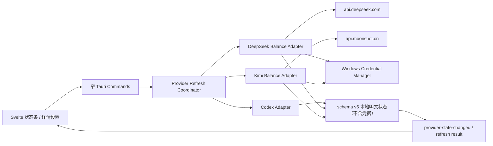

# QuotaDock 多供应商额度与余额查询实施计划

> 状态：已批准并实施（v0.6.0）
> 计划日期：2026-08-13
> 建议目标版本：v0.6.0
> 当前基线：v0.5.4 / 状态 schema v4

## 1. 目标与本期边界

在保留现有 Codex/GPT 1 周额度查询的基础上，新增：

1. DeepSeek API 开放平台余额查询，重点展示“充值余额”；
2. Kimi API 开放平台余额查询，展示可用余额、现金余额和代金券余额；
3. 三个供应商独立配置、独立刷新、独立错误和旧数据状态；
4. API Key 的本机安全保存与删除，不把密钥写入普通状态文件。

本计划中的“充值”只表示查询已经充值后的余额，不包含在 QuotaDock 内完成支付、
创建充值订单或模拟登录。DeepSeek 和 Kimi 均未公开文档化程序化充值 API。

本计划中的“Kimi 额度”暂按 **Kimi API 开放平台账户余额** 理解。Kimi API、
Kimi Code 和 Kimi 会员是互相独立的产品；本期不查询 Kimi Code 或 Kimi 会员权益。

## 2. 请先确认的产品决策

以下采用推荐项即可直接进入实施；如含义不同，应在编码前调整本计划。

| 决策 | 推荐方案 | 影响 |
|---|---|---|
| Kimi 额度口径 | Kimi API 开放平台可用余额 | 官方有稳定公开 API；Kimi Code/会员没有可复用的公开余额 API |
| Kimi 区域 | 首版仅支持国内站，不公开国际区域模型或端点 | 国内 Key 只调用 `api.moonshot.cn`；未来国际站需另立迁移方案 |
| DeepSeek 功能 | 查询总余额、赠金余额、充值余额 | 不在应用内执行充值；提供官方充值/账单页作为兜底 |
| 悬浮条布局 | **已确认：保持 `260 × 36`，按用户勾选的供应商循环显示** | 不改变现有悬浮体尺寸；详情页负责三家同屏总览 |
| 循环控制 | 设置页选择参与项；默认仅 Codex；每项 8 秒；hover/focus 暂停；支持手动下一项 | 选择跨重启保留；至少保留一项，未配置供应商不能加入 |
| 详情页 | 三张供应商卡片 + 独立连接状态 + 凭据管理 | 可查看完整余额拆分、最后成功时间和错误原因 |
| 刷新语义 | “刷新全部”并行查询，允许部分成功 | 单个供应商故障不会覆盖或拖垮另外两个供应商 |
| 凭据方式 | API Key 由用户在本机设置页输入一次，后端写入 Windows Credential Manager | Key 不回显、不写入 JSON、不进入日志；接受其短暂经过本地 Tauri IPC 的桌面应用威胁模型 |
| 历史与通知 | v0.6.0 只保留每家最新成功值，不新增余额趋势和低余额通知 | 先把查询、凭据和可信状态做稳，避免首版范围膨胀 |

## 3. Phase 0：文档发现与 Allowed APIs

### 3.1 现有工程事实

- `src-tauri/src/commands.rs:381` 至 `413` 是当前唯一刷新链，只查询 Codex；
- `src-tauri/src/models.rs:37` 至 `51` 的 `QuotaSnapshot` 强绑定单个周额度；
- `src-tauri/src/models.rs:110` 至 `133` 只保存一个最新快照；
- `src-tauri/src/usage_store.rs:85` 至 `113` 会把状态序列化为普通 JSON，不能存 API Key；
- `src-tauri/src/commands.rs:32` 至 `76` 使用全局单刷新锁，不能表达供应商级部分成功；
- `src/lib/state/usageState.svelte.ts:65` 至 `73` 只有全局成功/失败；
- `src/lib/components/QuotaDashboard.svelte:273` 至 `330` 只渲染 Codex 周额度；
- `src/lib/components/DetailsPanel.svelte:304` 至 `331` 只有一张额度卡；
- `src-tauri/tauri.conf.json:17` 至 `42` 固定了 `260 × 36` 主窗和 `440 × 600` 详情窗；
- `README.md` 和 `docs/product/quotadock-product-spec-v2.md` 当前明确是 Codex-only
  产品定义，并排除了 API Billing；本功能属于正式产品边界变更。

可复制的现有模式：

- 严格响应 DTO：`src-tauri/src/app_server.rs:14` 至 `52`；
- 超时和完整性校验：`src-tauri/src/app_server.rs:54` 至 `227`；
- 后台 worker、防重入和退避：`src-tauri/src/commands.rs:32` 至 `184`；
- 失败保留最后成功值：`src-tauri/src/commands.rs:381` 至 `413`；
- 原子状态保存和版本迁移：`src-tauri/src/usage_store.rs:38` 至 `219`；
- Rust/TypeScript DTO 镜像：`src-tauri/src/models.rs`、`src/lib/types/usage.ts`；
- 后端状态事件：`src-tauri/src/commands.rs:1514` 至 `1517`、
  `src/routes/+page.svelte:28` 至 `31`；
- 前端错误时保留旧值：`src/lib/state/usageState.svelte.ts:27` 至 `83`。

### 3.2 DeepSeek 官方契约

允许调用：

```http
GET https://api.deepseek.com/user/balance
Accept: application/json
Authorization: Bearer <DEEPSEEK_API_KEY>
```

允许读取：

```text
is_available: boolean
balance_infos[].currency: "CNY" | "USD"
balance_infos[].total_balance: string
balance_infos[].granted_balance: string
balance_infos[].topped_up_balance: string
```

官方参考：

- 查询余额：https://api-docs.deepseek.com/zh-cn/api/get-user-balance
- 错误码：https://api-docs.deepseek.com/zh-cn/quick_start/error_codes/
- 充值与余额说明：https://api-docs.deepseek.com/zh-cn/faq

注意：金额在官方响应中是字符串，代码不得先转成二进制浮点数；
`balance_infos` 应按多币种数组处理，不能只取第一项并假定永远是 CNY。

### 3.3 Kimi 官方契约

国内站允许调用：

```http
GET https://api.moonshot.cn/v1/users/me/balance
Authorization: Bearer <MOONSHOT_API_KEY>
```

国际站账户与国内站完全隔离。v0.6.0 不公开国际站 endpoint 或凭据目标，数据模型只允许
`china`，也不提供可编辑 base URL；未来若支持国际站需重新核验契约并设计迁移。

允许读取：

```text
code: integer              # 0 表示成功
data.available_balance: number
data.voucher_balance: number
data.cash_balance: number
scode: string
status: boolean
```

国内余额单位为人民币元。`cash_balance` 可以为负，不能自行用
现金余额与代金券余额重算 `available_balance`。JSON number 应通过
`serde_json::Number` 或十进制定点类型无损转成持久化字符串，不使用 `f32/f64`
承担财务展示口径。

官方参考：

- 查询余额：https://platform.kimi.com/docs/api/balance
- OpenAPI：https://platform.kimi.com/docs/openapi.json
- 产品边界：https://platform.kimi.com/docs/guide/product-plans
- 充值与限速：https://platform.kimi.com/docs/pricing/limits

Kimi 的 `X-RateLimit-Limit`、`X-RateLimit-Remaining`、`X-RateLimit-Reset` 只适合
后续实验性观测：官方未充分定义它们与 RPM、TPM、TPD、并发的映射和单位，
本期不把这些响应头宣称为“完整额度查询”。

### 3.4 本地凭据与 HTTP Allowed APIs

Windows-first 基线采用 Rust `keyring` 的 v1 接口：

```rust
Entry::new(service, username)
entry.set_password(secret)
entry.get_password()
entry.delete_credential()
```

`keyring` 在 Windows 上使用 Windows Credential Manager：
https://docs.rs/keyring/latest/keyring/v1/

HTTP 客户端只使用 `reqwest` 文档化接口：

```rust
reqwest::blocking::Client::builder().timeout(...).build()
client.get(url).bearer_auth(api_key).header(ACCEPT, "application/json").send()
```

参考：

- https://docs.rs/reqwest/latest/reqwest/blocking/struct.ClientBuilder.html
- https://docs.rs/reqwest/latest/reqwest/blocking/struct.RequestBuilder.html

### 3.5 明确禁止的实现

- 不抓取 DeepSeek/Kimi 控制台 DOM、Cookie、session 或私有接口；
- 不实现或臆造 `POST /recharge`、`POST /topup` 等充值接口；
- DeepSeek 余额路径不自行加 `/v1`；
- 不把 Kimi 的单次 token `usage` 或 token 估算接口当成账户剩余额度；
- 不把 Kimi `cash_balance` 推断为累计充值，也不由它推断当前 Tier；
- 不把 Kimi 会员或 Kimi Code 权益标成 Kimi API 余额；
- 不允许用户输入任意 API base URL，避免密钥被发送到非官方主机；
- 不关闭 TLS 证书或主机名验证，不记录 Authorization header 或完整错误正文；
- 不把 API Key 放进 `quotadock-state.json`、前端 store、浏览器 fixture、日志、遥测、
  截图或测试快照；
- 不让一个供应商失败把其他供应商的新快照回滚成旧值。

## 4. 目标架构



核心原则：

1. 供应商适配器只负责固定官方端点、鉴权、严格反序列化和错误分类；
2. 刷新协调器负责并行、去重、部分成功、旧值保留和事件广播；
3. 普通状态文件以本地明文保存额度/余额快照、设置和恢复信息，但不保存认证凭据或 API Key；
4. API Key 仅在 Rust 后端按需从 Windows Credential Manager 读取；
5. 前端只获得 `configured: boolean`，永远不能读取已保存密钥。

## 5. Phase 1：重构为多供应商数据模型

### 要实现

修改：

- `src-tauri/src/models.rs`
- `src-tauri/src/usage_store.rs`
- `src/lib/types/usage.ts`
- `src/lib/api/tauri.ts`

建议将 schema 升级为 v5，并引入：

```text
ProviderId = codex | deepseek | kimi
ProviderSnapshot = tagged enum:
  codex  -> weekly remaining/reset/plan/credits
  deepseek -> isAvailable + balances[]
  kimi -> region + currency + available/cash/voucher
ProviderState = configured + latestSnapshot + lastAttemptAt + health + errorCategory
AppState.providers = provider-keyed collection
RefreshProvidersResult = per-provider results + anyUpdated
AppSettings.floatingProviderIds = ordered ProviderId list
```

迁移时把 v4 的 `latestSnapshot` 和 `history` 无损放进 `providers.codex`；DeepSeek、
Kimi 初始化为未配置；`floatingProviderIds` 默认迁移为 `[codex]`，保持升级后的第一眼
体验不变。不要为了复用旧字段把金额塞进 `weekly` 或 `creditsBalance`。

轮播列表只保存不含凭据的 provider id，固定规范顺序为 `codex → deepseek → kimi`；
用户决定是否加入，不在本期提供自定义排序。设置层必须保证至少一项有效：如果删除
某供应商凭据导致它不再可显示，则同时将它移出轮播；若列表因此为空，回退到 Codex。

本期历史仍只保留现有 Codex 周额度；余额趋势等后续需求确认后再新增。

### 文档参照

- 复制 DTO 派生和 camelCase 序列化模式：`src-tauri/src/models.rs:6` 至 `162`；
- 复制 v2/v3 → v4 的迁移和备份模式：`src-tauri/src/usage_store.rs:38` 至 `113`、
  `203` 至 `219`；
- 复制 TypeScript 镜像方式：`src/lib/types/usage.ts`。

### 验证清单

- [ ] v4 有 Codex 快照的文件迁移后数据不丢失；
- [ ] v4 空状态迁移后得到三个合法 provider state；
- [ ] 迁移失败仍先备份，恢复提示保持可见；
- [ ] 序列化结果不含 `apiKey`、`token`、`Authorization`；
- [ ] Rust 与 TypeScript discriminated union 字段完全一致；
- [ ] 旧 Codex 稀疏历史和设置继续工作。
- [ ] v4 升级后轮播列表默认为仅 Codex，且 `260 × 36` 悬浮条行为不突变；
- [ ] 轮播列表去重、拒绝未知 provider id，并始终保留至少一个有效项。

### 反模式守卫

- 不保留一个全局 `latestSnapshot` 作为新的事实源；
- 不用一个全局 `updated: bool` 隐藏部分成功；
- 不以 `f32/f64` 持久化或比较余额；
- 不把错误原始响应持久化。

## 6. Phase 2：安全凭据管理

### 要实现

新增：

- `src-tauri/src/credentials.rs`

修改：

- `src-tauri/Cargo.toml`
- `src-tauri/src/lib.rs`
- `src-tauri/src/commands.rs`
- `src/lib/api/tauri.ts`

以固定 service 名 `com.rupingliu.quotadock` 和固定账户名区分凭据：

```text
deepseek-api-key
kimi-cn-api-key
```

提供窄命令：

```text
set_provider_credential(provider, region?, secret) -> CredentialStatus
delete_provider_credential(provider, region?) -> CredentialStatus
get_provider_credential_status() -> ProviderCredentialStatus[]
```

`get` 命令只能返回“已配置/未配置/凭据存储不可用”，不能返回 secret、前后缀或哈希。
设置成功后前端立即清空输入框；删除需要二次确认并只删除精确 provider/region 项。

为便于测试，业务层依赖一个最小 `CredentialStore` trait，生产实现包装 `keyring::Entry`，
测试使用内存 fake；不要在测试机真实凭据库中创建或删除条目。

### 文档参照

- 复制 `keyring::Entry` 官方 set/get/delete 模式：
  https://docs.rs/keyring/latest/keyring/v1/struct.Entry.html
- 复制现有设置命令和前端调用边界：`src-tauri/src/commands.rs:212` 至 `249`、
  `src/lib/api/tauri.ts:12` 至 `100`。

### 验证清单

- [ ] 可设置、替换、检测、删除每个供应商的凭据；
- [ ] DeepSeek 与 Kimi 凭据不会串用；
- [ ] 未配置、凭据库不可用和删除不存在条目有可理解的错误；
- [ ] Tauri 返回 DTO、日志、状态 JSON 和测试快照不含 key；
- [ ] 关闭并重启应用后，只返回“已配置”，不回显 key；
- [ ] 删除一个 Key 不影响其他供应商。

### 反模式守卫

- 不把 key 放入 `AppSettings`、`StoredState` 或环境诊断输出；
- 不提供 `get_provider_credential()` 给前端；
- 不在错误信息中拼接 `keyring` 条目内容或用户输入；
- 不使用可预测的临时文件保存 key。

## 7. Phase 3：DeepSeek 与 Kimi 官方余额适配器

### 要实现

新增：

- `src-tauri/src/providers/mod.rs`
- `src-tauri/src/providers/deepseek.rs`
- `src-tauri/src/providers/kimi.rs`
- `src-tauri/src/http_client.rs`

修改：

- `src-tauri/Cargo.toml`
- `src-tauri/src/lib.rs`

每个适配器接受后端读取到的 secret 和共享的固定配置 HTTP client，返回严格的
`ProviderSnapshot` 或脱敏 `ProviderError`。HTTP client 设置总超时、连接超时、
用户代理和有限响应体大小；只接受 HTTPS 官方 host 和预定义路径。

DeepSeek 直接映射官方 string 金额与多币种列表。Kimi 校验 HTTP 200 后还要校验
`code == 0`、`status == true` 和 `data` 完整；Kimi region 决定固定 host 和币种标签。

错误至少分为：

```text
not-configured | unauthorized | insufficient-balance | rate-limited |
timeout | network | server | invalid-response | credential-store
```

只保存/展示稳定分类与自有中文说明；上游错误 body 可以受限读取用于本地调试分类，
但不得原样落盘或广播到前端。

### 文档参照

- DeepSeek 请求/响应复制自官方“查询余额”文档；
- Kimi 请求/响应复制自官方 `balance` 页面和 OpenAPI；
- 严格 DTO 和缺字段拒绝策略复制：`src-tauri/src/app_server.rs:14` 至 `52`、
  `187` 至 `227`；
- HTTP builder 与 Bearer auth 只用 Phase 0 列出的 `reqwest` 文档化接口。

### 验证清单

- [ ] DeepSeek：单币种、多币种、零余额、字符串小数、额外未知字段；
- [ ] Kimi：正常余额、零可用余额、负现金余额、`code/status` 失败；
- [ ] 两家：401、429、500、503、超时、断网、非 JSON、缺字段、超大响应体；
- [ ] URL 测试证明 Key 只能发往允许的官方 endpoint；
- [ ] Authorization 标记为敏感，Debug/Display 输出不含其值；
- [ ] fixture 均为脱敏本地 JSON，不调用真实账户；
- [ ] 可选 ignored contract test 只从环境变量读取测试 key，且永不打印响应或 key。

### 反模式守卫

- 不跟随重定向把 Authorization 带到其他 host；建议余额请求禁用重定向；
- 不把所有 429 都翻译成余额不足；
- 不吞掉 Kimi `code/status` 只看 HTTP 200；
- 不假设 DeepSeek 只有一个币种；
- 不把上游 response/body 放进 `ProviderSnapshot.rawText`。

## 8. Phase 4：供应商级刷新、部分成功与调度

### 要实现

修改：

- `src-tauri/src/commands.rs`
- `src-tauri/src/tray.rs`
- `src-tauri/src/lib.rs`

把 Codex 现有采集链包装成 `CodexProvider`，保留 App Server 主源和 PTY 降级，不重写
已经验证的解析器。刷新协调器改成 provider-aware：

1. `refresh_all` 对已配置供应商并行刷新；未配置供应商标为 skipped；
2. 每个供应商独立防重入、独立最后尝试时间和连续失败次数；
3. 某家成功就原子更新该家快照；某家失败保留该家最后成功值；
4. 返回 per-provider result，并发出统一状态事件；
5. 托盘“刷新额度”改为“刷新全部”，详情页可单独刷新某家；
6. 自动刷新以 5 分钟为基础，网络供应商失败沿用 5/10/20/30 分钟退避；
7. Codex 临近重置和低额的现有自适应规则只作用于 Codex，不错误套用人民币余额。

首轮不根据余额值加速请求或发送低余额通知。未配置供应商不计为失败，也不增加退避。

### 文档参照

- 复制现有 coordinator、worker 和退避：`src-tauri/src/commands.rs:32` 至 `184`；
- 复制旧快照保留：`src-tauri/src/commands.rs:381` 至 `413`；
- 复制事件和托盘同步：`src-tauri/src/commands.rs:345` 至 `372`、
  `1514` 至 `1517`；
- Codex 采集器直接包裹 `src-tauri/src/commands.rs:430` 至 `462`。

### 验证清单

- [ ] 三家同时成功时一次刷新得到三个新时间戳；
- [ ] 一家失败、两家成功时结果为 partial success，成功快照仍保存；
- [ ] 失败供应商保留旧值并显示失败/陈旧，不能伪装成本次成功；
- [ ] 连续点击、托盘刷新、前台唤醒和后台刷新不会重复查询同一家；
- [ ] 未配置供应商不会阻塞 Codex，也不会持续弹错；
- [ ] 每家退避相互独立，Codex 的低额度/重置规则未回归；
- [ ] 退出/重启后最新成功快照和陈旧语义正确。

### 反模式守卫

- 不串行等待最长 45 秒的 Codex PTY 后才开始网络查询；
- 不用一个全局锁导致单家卡死时三家都不能刷新；
- 不以“全部成功”作为保存任何新值的条件；
- 不因网络余额为零而启动 1 分钟轮询。

## 9. Phase 5：可配置轮播 UI、设置与官方兜底

### 要实现

修改：

- `src/lib/state/usageState.svelte.ts`
- `src/routes/+page.svelte`
- `src/lib/components/QuotaDashboard.svelte`
- `src/lib/components/DetailsPanel.svelte`
- `src/lib/components/QuotaDashboard.test.ts`
- `src/lib/components/DetailsPanel.test.ts`
- `src/lib/state/usageState.test.ts`
- `src/lib/utils/format.ts`
- `src-tauri/src/details.rs`
- `design-system/quotadock/MASTER.md`

主悬浮条严格保持当前 `260 × 36`，任何实现不得修改 `src-tauri/tauri.conf.json`
中的主窗尺寸。悬浮条每次只显示一个供应商，复用现有主指标、次要信息、新鲜度、
状态点和菜单区域：

```text
Codex   1周 86% · 2天      | 状态/菜单
DeepSeek 充值 ¥100.00      | 状态/菜单
Kimi     可用 ¥49.59       | 状态/菜单
```

轮播行为采用以下确定规则：

1. 详情设置中为每家提供“加入悬浮条轮播”开关；DeepSeek/Kimi 未配置凭据时开关禁用；
2. 默认只选择 Codex；已选择项按 `Codex → DeepSeek → Kimi` 固定顺序循环；
3. 每项停留 8 秒，切换时只替换内容，不使用滑动、闪烁或缩放动画；
4. 只有一个选中项时不启动计时器；页面不可见时停止计时；
5. 指针悬停悬浮条或键盘焦点位于悬浮条内时暂停，离开后重新等待完整 8 秒；
6. 供应商标签是独立可聚焦按钮，点击或按 Enter/Space 可立即切到下一项，且不改变
   已选集合；按钮以外区域继续用于拖动窗口；
7. `prefers-reduced-motion: reduce` 时关闭自动循环，保留手动切换；
8. 自动切换本身不触发 `aria-live` 重复播报；真实刷新结果和错误仍按现有状态通道播报；
9. 当前项刷新失败时显示该家的最后成功值并标失败/陈旧，下一轮继续显示其他供应商；
10. Key 被删除时该供应商自动退出轮播并给出一次明确提示。

悬浮条只显示当前供应商的主指标：Codex 周剩余百分比、DeepSeek 充值余额或 Kimi
可用余额。完整拆分、币种、来源、最后成功时间、错误和三家同屏总览放在详情页。

详情页改为：

1. 供应商概览三卡；
2. 每卡独立的 fresh/busy/error/stale/not-configured 状态；
3. DeepSeek 展示总额、充值余额、赠金余额和 `is_available`；
4. Kimi 展示可用、现金、代金券和区域；
5. 设置区提供密码型输入、保存/替换、删除连接，并明确固定为国内区域；
6. 在每家连接设置旁提供“加入悬浮条轮播”开关和当前选择摘要；
7. 保存后只显示“已配置”，不回填 key；
8. 提供固定官方余额/充值/用量链接作为核验和功能边界兜底。

API Key 输入必须设置 `autocomplete="off"`、关闭拼写检查，保存成功/失败后清空组件状态；
错误文案不得包含用户输入。轮播选择通过现有 `AppSettings` / `SettingsPatch` 的普通
状态持久化链保存；它只包含 provider id，不与 Credential Manager 中的 secret 混存。

### 文档参照

- 状态语义复制：`src/lib/components/QuotaDashboard.svelte:199` 至 `270`；
- 详情卡和设置调用复制：`src/lib/components/DetailsPanel.svelte:304` 至 `331`、
  `415` 至 `469`；
- 前端 per-result 应用逻辑从 `src/lib/state/usageState.svelte.ts:65` 至 `73` 扩展；
- 设置持久化复制 `src-tauri/src/models.rs:84` 至 `98`、
  `src-tauri/src/usage_store.rs:312` 至 `319` 的现有模式；
- UI 取舍遵循 `design-system/quotadock/MASTER.md` 的 `260 × 36`、扫视性、非纯颜色
  告警、减少动画和键盘规则。

### 验证清单

- [ ] `tauri.conf.json` 主窗仍为 260×36，系统 125%/150% 缩放、浅色/深色均无溢出；
- [ ] 升级前后的窗口大小和位置状态均不迁移、不跳动；
- [ ] 选择 1/2/3 家时分别不循环、两项循环、三项循环，顺序和 8 秒停留正确；
- [ ] 选择项跨重启持久化，v4 升级和新安装均默认只显示 Codex；
- [ ] 禁止取消最后一个有效项；删除凭据后列表能安全回退且不留下空白主条；
- [ ] hover、focus、页面隐藏和 reduced-motion 下暂停规则正确；手动“下一项”可用；
- [ ] 自动轮播不造成重复读屏，手动切换后三家数值、币种和标签可被正确识别；
- [ ] 不能只用颜色表达失败、陈旧、未配置或余额不可用；
- [ ] Key 保存后 DOM、前端 state 和错误提示中均不再保留明文；
- [ ] 一家失败不会让其余两家卡片显示失败；
- [ ] 浏览器 fixture 覆盖全成功、部分失败、未配置、陈旧、零余额和轮播暂停；
- [ ] 固定官方链接只能打开预定义 HTTPS URL。

### 反模式守卫

- 不在 36px 主条展示所有余额拆分；
- 不扩大、动态调整或随供应商改变 `260 × 36` 窗口尺寸；
- 不轮播用户未勾选的供应商，也不让未配置供应商占用轮播时间；
- 不在 hover/focus 时切走用户正在阅读或操作的内容；
- 不用自动轮播持续触发 `aria-live`；
- 不把 `0` 当成空值或查询失败；
- 不以小数位格式化改变官方金额含义；
- 不在 HTML 属性、title 或 aria-label 中包含 API Key。

## 10. Phase 6：文档、隐私与发布准备

### 要实现

新增或修改：

- 新增 `docs/adr/0002-multi-provider-balances-and-credential-storage.md`；
- 将 `docs/product/quotadock-product-spec-v2.md` 升级为多供应商产品规格；
- 更新 `README.md` 的产品定义、数据来源、隐私与开发依赖；
- 更新 `design-system/quotadock/MASTER.md` 的可配置轮播主条规范；
- 发布时新增 `docs/releases/v0.6.0.md`。

文档必须明确：

- QuotaDock 是非官方本地工具；
- DeepSeek/Kimi 查询的是 API 开放平台余额；
- Kimi API 与会员/Kimi Code 不互通；
- 应用可在用户同意后把供应商 API Key 保存到 Windows Credential Manager；
- 普通状态 JSON 以本地明文保存额度/余额快照和设置，但不保存认证凭据或 API Key；
- 余额可能因上游延迟而滞后，官方控制台仍是最终核验来源；
- 删除 QuotaDock 普通数据与删除 Windows 凭据是两个明确动作，卸载行为要如实说明。

### 验证清单

- [ ] README、Product Spec、ADR、设计系统和实现口径一致；
- [ ] 不再声称产品“不读取或保存任何令牌”，改成精确的供应商凭据说明；
- [ ] 不再把 API Billing 列入“暂不新增”；
- [ ] 所有官方链接与 endpoint 再次对照最新官方文档；
- [ ] 发布说明列出 schema v5、轮播默认/选择/暂停规则和凭据删除方法；
- [ ] README 与设计系统明确悬浮条仍为 `260 × 36`，不出现旧的 420px 方案。

### 反模式守卫

- 不把 Windows Credential Manager 描述为 QuotaDock 自己加密的 JSON；
- 不声称余额绝对实时或与网页端消费者产品共享；
- 不承诺官方未公开的限流、Tier、交易记录或账户历史用量。

## 11. Phase 7：最终验证与发布门禁

### 自动化验证

```powershell
npm test
npm run build
cargo fmt --manifest-path src-tauri/Cargo.toml -- --check
cargo check --manifest-path src-tauri/Cargo.toml --all-targets --all-features
cargo test --manifest-path src-tauri/Cargo.toml --all-features
git diff --check
```

### 安全 grep

```powershell
rg -n "api[_-]?key|Authorization|Bearer|token|password" src src-tauri docs
rg -n "danger_accept_invalid|danger_accept_invalid_hostnames|http://api" src-tauri
rg -n "recharge|topup|transactions|billing-history|tier" src-tauri/src/providers
```

逐条人工确认命中位置只包含：类型名、固定请求 header 构造、脱敏文案、测试假值或文档；
不得出现真实 secret、私有接口或禁用 TLS 的代码。

### Windows 冒烟测试

- [ ] 从 v0.5.4 带 Codex 快照升级，数据、`260 × 36` 窗口位置和设置保留；
- [ ] 全新安装时 Codex 可用，DeepSeek/Kimi 显示未配置而不是报错；
- [ ] 设置测试 Key 后刷新成功，重启仍显示“已配置”；
- [ ] 无效 Key 明确显示认证失败，旧余额保留并标陈旧；
- [ ] 断网/代理/超时/上游 500 时三家独立降级；
- [ ] 删除 DeepSeek Key 后只影响 DeepSeek；
- [ ] 轮播选择跨重启保留，删除已选供应商 Key 后自动移出且至少剩一项；
- [ ] 自动循环、hover/focus 暂停、reduced-motion 手动模式符合计划；
- [ ] Windows Credential Manager 中没有明文状态 JSON 的副本；
- [ ] 应用自身序列化的 `quotadock-state.json`、日志和诊断复制内容不含 API Key；损坏、
  不兼容或受外部污染的状态文件仍按既有恢复机制原样备份，因此该备份可能保留用户或
  外部程序事先写入的任意原文，不能把它表述为应用生成或保存了供应商凭据；
- [ ] 官方充值/余额链接打开正确页面，软件内没有支付动作；
- [ ] 升级安装和卸载后的凭据保留/删除行为与文档一致。

### 可选真实契约测试

由维护者在本机显式设置临时低权限测试 Key 后运行 ignored tests，仅验证：

- HTTP 200 和已文档字段可解析；
- 日志、panic 和失败输出不包含 Key 或完整财务响应。

测试结束立即从环境和 Windows Credential Manager 删除临时 Key。真实测试不进入 CI，
也不把余额断言为固定数值。

## 12. 建议交付切片

| 切片 | 内容 | 完成判定 |
|---|---|---|
| A | schema v5 + provider DTO + v4 迁移 | 旧 Codex 数据无损，三家状态可表达 |
| B | Windows Credential Manager 封装 | Key 可设置/替换/删除且不回显、不写 JSON |
| C | DeepSeek/Kimi 余额适配器 | 官方 fixture、错误分类和安全测试通过 |
| D | provider-aware 刷新与调度 | 并行、部分成功、独立旧值/退避通过 |
| E | 轮播主条/详情/设置 UI | 尺寸不变、选择可持久化、轮播/暂停/无障碍通过 |
| F | 文档、升级、Windows 冒烟 | 产品口径和隐私承诺一致，发布门禁全绿 |

## 13. 本计划不包含的后续候选

- DeepSeek/Kimi 余额趋势、消费预测和低余额通知；
- Kimi `X-RateLimit-*` 实验性展示；
- Kimi Tier、项目预算和账户级历史用量；
- Kimi Code 或 Kimi 会员额度；
- 充值交易记录、发票、退款和应用内支付；
- macOS Keychain / Linux Secret Service 的正式支持；
- 多账号、多组织和自定义 API 代理地址。

这些能力只有在获得稳定官方契约和明确用户需求后另立计划，不能通过抓取控制台或
推断余额差值补齐。
